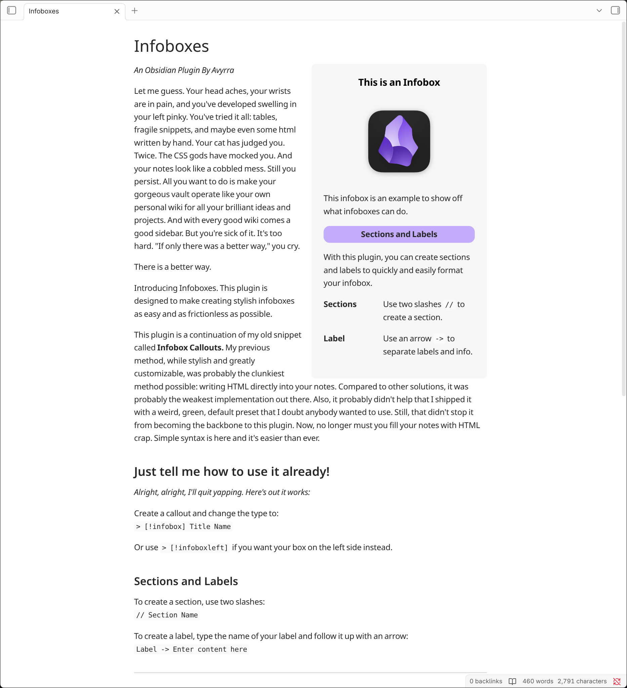
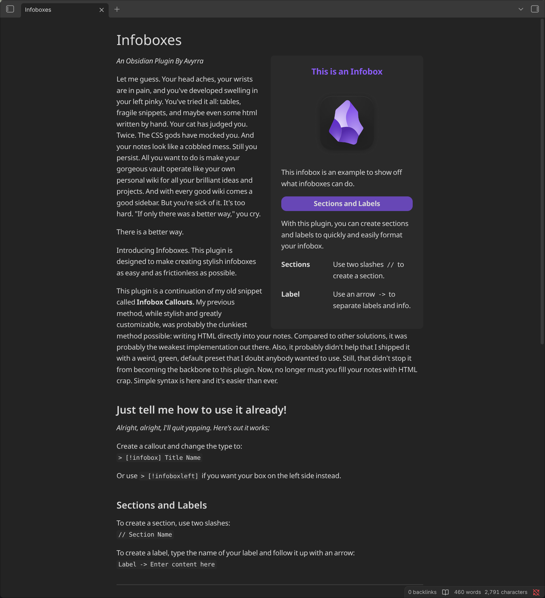

This plugin allows you to create wiki-like sidebars. It utilizes callouts and custom syntax to make creating infoboxes simple and intuitive.

# How to Install
This plugin is not yet on the community plugins browser, however it can still be installed and updated via the BRAT plugin.

1. Enable Community plugins in obsidian and install the BRAT plugin. Enable it.
2. Open the BRAT plugin options and scroll down to "Beta plugin list"
3. Click add beta plugin
4. Copy and paste this repository's URL into the window that appears
5. Select latest version
6. Click Add Plugin
   
# How to use
To create an infobox, insert a callout and change the type to **infobox:**
`> [!infobox] Title Name` 

An infobox will float to the right of any content whose source written after the callout. If you would like the infobox to be on the left side, you can use `> [!infoboxleft]` instead.

Within the callout, you can use two slashes to create a section. `// Section Name`

To create a label, use an arrow to separate the name of your label with the information that you'd like to to display next to it: `Label Name -> Add information here`

### Example
``` markdown
> [!infobox] Title Name
> 
> 
> // Section Name
> 
> Label -> Info
```

## Dynamically Insert Properties
You can use the `~yaml` command to dynamically insert properties within an infobox. All properties will be displayed as labels. Functional properties such as aliases or tags will not be displayed. When properties are updated, they will automatically be reflected in the infobox.

If you would like to display only a specific selection of properties, you can use commas to denote which properties you'd like to use. With this method, you can also choose to display functional properties that were previously filtered.
Example: `~yaml, aliases, tags, size, color`

Additionally, you can choose to render all but a selection by appending it with an exclamation point. All properties will be displayed as labels with the exception of functional properties and your selection.
Example: `~!yaml, size, color`

### Example
``` markdown
> [!infobox] Title Name
> 
> // Section Name
> 
> ~yaml
```

### Aliases
The following aliases can be used instead of `~yaml`

`~metadata`
`~properties`
`~meta`
`~data`
`~fields`

## Customization

### Style Settings
Styles, colors, and additional tweaks can be customized by installing the **Style Settings** plugin. Once installed, the infoboxes customization menu will be displayed within the Style Settings plugin options.

### Snippets
The .css file for infoboxes does not utilize the `!important` rule. If you would like to make adjustments to infoboxes, you can do so with a snippet.